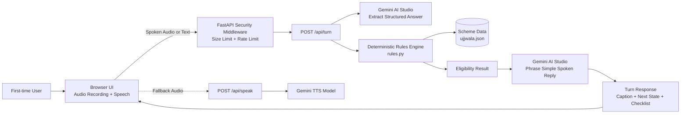

# HerVoice

Voice-first multilingual AI guide empowering first-time women users in India to independently access essential government schemes in their own language.

Live demo: <ADD VERCEL LINK HERE>

---

## The Problem: "The Invisible Woman"

Millions of women across India lack digital literacy, English proficiency, and personal assistance, leaving them excluded from life-changing welfare schemes. HerVoice removes every technological barrier by turning complex scheme eligibility into a simple, spoken conversation requiring zero prior digital knowledge.

---

## Problem Statement Alignment

| Requirement | Implementation & Feature | Source / Proof |
| --- | --- | --- |
| **First-time woman user** | Minimal cognitive load, warm audio-visual prompts, and no account or onboarding barriers. | [`static/index.html`](static/index.html), [`static/app.js`](static/app.js) |
| **No English** | All core instructions, voice prompts, buttons, statuses, and documents are translated and spoken in the user's native tongue. | [`app/config.py`](app/config.py), [`static/app.js`](static/app.js) |
| **No tech background** | Single tap interaction, clear visual touch targets (≥48px), and high-contrast color-coded controls. | [`static/styles.css`](static/styles.css), [`static/index.html`](static/index.html) |
| **No one to ask** | Patient repetition after silence, instant repeat-audio button on every message, and automatic text fallback. | [`static/app.js`](static/app.js) |
| **One essential scheme** | Grounded guidance for Pradhan Mantri Ujjwala Yojana (PMUY) with required document checklists and distributor instructions. | [`data/schemes/ujjwala.json`](data/schemes/ujjwala.json), [`app/rules.py`](app/rules.py) |
| **Voice or simple text** | Seamless dual-input dock: large microphone button alongside an accessible text box and send button. | [`static/index.html`](static/index.html), [`static/app.js`](static/app.js), [`app/schemas.py`](app/schemas.py) |
| **Own language** | Automated detection and localization supporting 6 major Indian languages. | [`app/config.py`](app/config.py), [`app/gemini_service.py`](app/gemini_service.py), [`tests/test_language_support.py`](tests/test_language_support.py) |
| **Zero prior digital knowledge** | Visual progress indicator dots, green tick / red cross tap answers, and spoken guidance requiring no reading skills. | [`static/app.js`](static/app.js), [`static/styles.css`](static/styles.css) |
| **Gemini-powered** | Gemini understands natural speech/text inputs and phrases simple, empathetic spoken replies while rules remain deterministic. | [`app/gemini_service.py`](app/gemini_service.py), [`app/routes.py`](app/routes.py) |
| **SDG alignment** | Advances gender equality, technology access, and inclusion under SDGs 5.1, 5.b, 4.3, 4.4, and 10.2. | [`README.md`](README.md) |

---

## Features & User Journey

1. **Language Selection & Greeting**:
   - The user opens the app and selects their language from six clear options.
   - The app begins with a warm, spoken greeting in the chosen language.
2. **Interactive Questioning**:
   - Questions are spoken aloud and displayed as readable chat bubbles with repeat-audio buttons.
   - For yes/no questions, two large tap buttons appear: a green checkmark (Yes) and a red cross (No).
3. **Flexible Input**:
   - The user can tap the prominent red microphone to speak or type an answer in the input box.
   - Enter submits the text, and duplicate submissions are disabled during processing.
4. **Live Guidance & Status**:
   - Real-time status shows whether the system is listening, thinking, or speaking.
   - A 4-dot progress indicator tracks progress through the scheme criteria.
5. **Eligibility & Document Checklist**:
   - Once questions are answered, the user receives an immediate spoken verdict.
   - If eligible, an icon-coded checklist of required documents (Aadhaar, Ration Card, Bank Passbook, etc.) is presented.

---

## Architecture



Eligibility is evaluated strictly by the deterministic rules engine in [`app/rules.py`](app/rules.py), never by the LLM. Gemini is utilized solely to extract structured intent from conversational speech/text and to phrase simple, conversational explanations. All facts, criteria, and document requirements are grounded directly in [`data/schemes/ujjwala.json`](data/schemes/ujjwala.json). The backend is completely stateless and stores no user audio, transcripts, or personal data.

---

## Tech Stack

| Layer | Technology |
| --- | --- |
| **Backend** | Python 3.12, FastAPI, Pydantic v2 |
| **AI / LLM** | Google GenAI SDK (`google-genai`), Gemini 3.5 Flash |
| **Speech Generation** | Browser `speechSynthesis` + Gemini TTS fallback |
| **Security** | Custom security middleware (CSP, nosniff, per-IP rate limiting, body size limits) |
| **Frontend** | Vanilla HTML5, CSS3, modern ES6 JavaScript (No frameworks, zero external CDN deps) |
| **Deployment** | Vercel Serverless Functions / Docker Container |

### SDG Mapping

- **SDG 5.1 (End Discrimination Against Women)**: Lowers bureaucratic and information hurdles preventing marginalized women from claiming public entitlements.
- **SDG 5.b (Empower Women via Technology)**: Leverages voice-first AI interfaces to make technology accessible without prerequisite digital literacy.
- **SDG 4.3 (Equal Access to Public Knowledge)**: Bridges the information divide by translating complex government documents into plain vernacular speech.
- **SDG 4.4 (Relevant Digital Skills)**: Encourages first-time users to comfortably interact with interactive digital systems.
- **SDG 10.2 (Promote Universal Social and Economic Inclusion)**: Empowers excluded citizens across linguistic demographics with equitable access to energy welfare.

### Supported Languages

- **हिन्दी** (`hi-IN`) — Hindi
- **தமிழ்** (`ta-IN`) — Tamil
- **తెలుగు** (`te-IN`) — Telugu
- **বাংলা** (`bn-IN`) — Bengali
- **मराठी** (`mr-IN`) — Marathi
- **ಕನ್ನಡ** (`kn-IN`) — Kannada

---

## Local Setup

### Prerequisites
- Python 3.12+
- A Google AI Studio API key (free tier)

### Installation

1. **Clone the repository**:
   ```bash
   git clone <REPO_URL>
   cd HerVoice
   ```

2. **Create and activate a virtual environment**:
   ```bash
   python -m venv .venv
   # On Windows:
   .\.venv\Scripts\Activate.ps1
   # On Linux/macOS:
   source .venv/bin/activate
   ```

3. **Install dependencies**:
   ```bash
   pip install -r requirements.txt
   ```

4. **Configure environment**:
   Copy `.env.example` to `.env` and insert your Gemini API key:
   ```bash
   cp .env.example .env
   ```
   Ensure `.env` contains:
   ```env
   GEMINI_API_KEY=your_actual_api_key_here
   GEMINI_MODEL=gemini-3.5-flash
   GEMINI_TTS_MODEL=gemini-3.8-flash-tts
   DEFAULT_LANG=hi-IN
   ```

5. **Run the application**:
   ```bash
   uvicorn app.main:app --host 0.0.0.0 --port 7860 --reload
   ```
   Open `http://localhost:7860` in your browser.

---

## Deployment

### Vercel Deployment

1. Push your repository to GitHub or GitLab.
2. Import the project into [Vercel](https://vercel.com/).
3. In **Settings → Environment Variables**, add the four variables:
   - `GEMINI_API_KEY`
   - `GEMINI_MODEL` (`gemini-3.5-flash`)
   - `GEMINI_TTS_MODEL` (`gemini-3.8-flash-tts`)
   - `DEFAULT_LANG` (`hi-IN`)
4. Deploy. Vercel automatically uses [`vercel.json`](vercel.json) and routes requests through [`index.py`](index.py).

### Docker Deployment

You can build and run the standalone container locally or on any container platform:

```bash
docker build -t hervoice .
docker run -p 7860:7860 \
  -e GEMINI_API_KEY="your_api_key" \
  -e GEMINI_MODEL="gemini-3.5-flash" \
  -e GEMINI_TTS_MODEL="gemini-3.8-flash-tts" \
  -e DEFAULT_LANG="hi-IN" \
  hervoice
```

---

## Testing & Quality Assurance

Run the automated test suite and style linters:

```bash
# Run pytest test suite (46 tests)
pytest

# Check code formatting and style
ruff check .
black --check .

# Validate frontend syntax
node --check static/app.js
```

---

## Scaling to Additional Schemes

The core architecture is generic. To introduce a new government scheme:
1. Create a scheme definition JSON file in `data/schemes/<scheme_name>.json` specifying eligibility criteria, question sequences, and required documents.
2. Adjust scheme selection in [`app/routes.py`](app/routes.py).
3. The deterministic rules evaluator and prompt construction adapt automatically without custom rule logic.

---

## Known Limitations

- **Device Voice Differences**: Availability and quality of browser voices vary by device operating system and browser vendor; if unavailable, on-screen captions and Gemini TTS provide the fallback.
- **Gemini Free-Tier Rate Limits**: Free tier quotas at Google AI Studio apply rate limits during heavy usage. The client includes automated retry logic.
- **In-Memory Rate Limiting**: The built-in request limiter operates in-memory per serverless instance rather than across a shared cache.
- **Unverified Output Language**: The output language is instructed to Gemini but not independently validated by a secondary model.
- **Official Scheme Verification**: Scheme criteria and short descriptions should always be checked against official portal announcements; the LPG distributor makes the final statutory determination.
