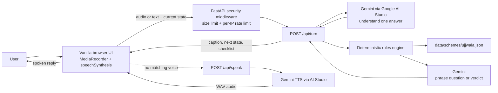

# HerVoice

HerVoice is a voice-first guide that helps women in India check PM Ujjwala Yojana eligibility and view the listed documents in a supported language.

## Problem Statement Alignment

| Problem statement phrase | HerVoice feature | Proof in this repository |
| --- | --- | --- |
| First-time woman user | No signup, login, or profile form before the guide starts | [`static/index.html`](static/index.html), [`app/main.py`](app/main.py) |
| No English | Fixed controls, retry messages, first prompts, and document labels are localized; Gemini is prompted to use the selected locale | [`static/app.js`](static/app.js), [`app/config.py`](app/config.py), [`app/gemini_service.py`](app/gemini_service.py) |
| No technical background; zero prior digital knowledge | One Start action begins the guided sequence; the next action is the large microphone control | [`static/index.html`](static/index.html), [`static/app.js`](static/app.js) |
| No one to ask | Repeats the current question after silence and offers text input after another silent attempt or microphone failure | [`static/app.js`](static/app.js) |
| Independently access one essential government scheme | PMUY questions, deterministic eligibility, document checklist, and official application options | [`app/rules.py`](app/rules.py), [`data/schemes/ujjwala.json`](data/schemes/ujjwala.json), [`app/routes.py`](app/routes.py) |
| Voice or simple text input | MediaRecorder audio and text both reach `/api/turn` | [`static/app.js`](static/app.js), [`app/schemas.py`](app/schemas.py), [`app/routes.py`](app/routes.py) |
| Her own language | Six tested locale codes are normalized to supported values; captions use the detected locale | [`app/config.py`](app/config.py), [`app/gemini_service.py`](app/gemini_service.py), [`tests/test_language_support.py`](tests/test_language_support.py) |
| Every reply is spoken and captioned | Browser speech synthesis, Gemini TTS fallback when no matching browser voice exists, and persistent captions | [`static/app.js`](static/app.js), [`app/routes.py`](app/routes.py), [`static/index.html`](static/index.html) |
| Eligibility must not be decided by AI | Scheme criteria are evaluated in deterministic Python; Gemini only extracts one answer and phrases a response | [`app/rules.py`](app/rules.py), [`app/gemini_service.py`](app/gemini_service.py) |
| Scheme facts must be grounded | Questions, criteria, documents, and source URL are held in the PMUY JSON file | [`data/schemes/ujjwala.json`](data/schemes/ujjwala.json) |
| No audio or personal answers retained | Client sends each turn with its current state; the server has no persistence layer and does not log request content | [`app/routes.py`](app/routes.py), [`app/security.py`](app/security.py) |
| Deployable container | Docker listens on `$PORT`, default `7860` | [`Dockerfile`](Dockerfile) |

## SDG Mapping

These are intended contributions, not measured impact claims.

| Goal target | Connection to HerVoice |
| --- | --- |
| SDG 5.1 | Reduces one information barrier that can prevent women from independently checking access to a public scheme; it does not measure or eliminate discrimination. |
| SDG 5.b | Uses accessible voice technology to support women's access to information. |
| SDG 4.3 | Provides a low-barrier digital interaction, but is not a technical or vocational education program. |
| SDG 4.4 | Gives users an opportunity to practice basic digital interaction; skill outcomes are not measured. |
| SDG 10.2 | Offers the same scheme guidance across supported languages and through voice or text. |

## Architecture



The browser sends each turn with client-held answers. The server does not retain conversation state, audio, or profile answers. Per-IP rate-limit counters use a process-random HMAC of the IP; stale buckets are evicted during subsequent API traffic. Request/access logging is disabled in the container.

## Google Services

- **Gemini API through Google AI Studio**: interprets one answer and phrases a response. Configure `GEMINI_API_KEY` and `GEMINI_MODEL` through environment variables.
- **Browser `speechSynthesis`**: preferred speech output. If no exact or language-prefix voice exists, the browser calls `POST /api/speak` for a Gemini TTS WAV using `GEMINI_TTS_MODEL`. The documented `gemini-3.8-flash-lite-tts` model is free in the AI Studio free tier, subject to quotas.
- HerVoice does not use Cloud Text-to-Speech, Secret Manager, or other Google Cloud APIs.
- **Deployment**: Hugging Face Spaces (Docker). Cloud Run is not part of the current deployment target.

## Tested Languages

The automated language-mapping tests cover only `hi-IN` (हिन्दी), `ta-IN` (தமிழ்), `te-IN` (తెలుగు), `bn-IN` (বাংলা), `mr-IN` (मराठी), and `kn-IN` (ಕನ್ನಡ), including unsupported-language fallback. The generated reply language is requested from Gemini but not independently validated; device speech voices and recognition accuracy also vary and have not been certified for every device or speaker.

## Local Setup

Requires Python 3.12 and a Gemini API key from Google AI Studio.

```powershell
py -3.12 -m venv .venv
.\.venv\Scripts\Activate.ps1
python -m pip install -r requirements.txt
$env:GEMINI_MODEL = "your-current-supported-model-id"
$env:GEMINI_TTS_MODEL = "gemini-3.8-flash-lite-tts"
$env:DEFAULT_LANG = "hi-IN"
python -m uvicorn app.main:app --host 0.0.0.0 --port 7860 --no-access-log
```

Before starting, set `GEMINI_API_KEY` in the shell to your Google AI Studio key. Open `http://localhost:7860`. The model ID is supplied by configuration rather than embedded in source. Do not commit `.env` or put a key in source files or logs.

Run checks locally:

```powershell
ruff check .
black --check app tests
pytest
```

## Hugging Face Spaces Deployment

1. Create a Space and select the **Docker** SDK.
2. Push this repository to the Space repository, or connect the GitHub repository in Space settings.
3. In Space **Settings → Variables and secrets**, add `GEMINI_API_KEY` as a secret and `GEMINI_MODEL`, `GEMINI_TTS_MODEL`, plus `DEFAULT_LANG` as variables. Select models available to the AI Studio key's free tier.
4. The Docker image starts Uvicorn on `0.0.0.0:$PORT`, defaulting to `7860` for Spaces.
5. Open the Space URL and test microphone permission, available voices, and text fallback on the target device.

The app makes Gemini requests at runtime. Free-tier quotas and availability depend on the selected model and account; no paid Google Cloud service is configured.

## Adding a Scheme

The deterministic engine is generic: questions, criteria, documents, and the source URL belong in a JSON file under `data/schemes/`. Add a new JSON file following [`data/schemes/ujjwala.json`](data/schemes/ujjwala.json); `load_scheme(scheme_id)` and `evaluate_eligibility(...)` need no scheme-specific rules code. The current API intentionally selects PMUY in [`app/routes.py`](app/routes.py); activating another scheme also requires selecting its ID there.

## Known Limitations

- Browser voices, pronunciation, and availability vary by device. Captions remain visible if a matching voice is unavailable.
- Gemini TTS fallback also depends on free-tier model access and quota; if it fails, the caption remains visible.
- Gemini AI Studio free-tier quotas and rate limits may delay or temporarily prevent responses. The service retries briefly, then asks the user to try again.
- Per-IP rate limiting is in-memory per application process; it is not a shared global limit across replicas.
- The scheme's short description remains marked `TODO: verify from official source`. The distributor makes the official eligibility decision.
